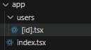

Para poder crear un proyecto con expo para react native empezamos utilizando el comando 
```bash
npx create-expo-app -t
```
en este caso se utilizo un template de typescript

despues se instalan las dependencias necesarias para el proyecto

```bash
npx expo install expo-router react-native-safe-area-context react-native-screens expo-linking expo-constants expo-status-bar
```

Despues se ajusta el entry point para el proyecto y es ajustando el package.json con expo-router para poder utilizar el sistemas de archivos que este necesita

```bash
{
  "main": "expo-router/entry",
}

```
Se remplaza por el que ya esta, y en el app.json se le adiciona este comando
```bash
    "scheme": "your-app-scheme"
```
Y por ultimo añadimos al babel.config.js lo siguiente:
```bash
module.exports = function (api) {
  api.cache(true);
  return {
    presets: ['babel-preset-expo'],
  };
};
```

Y ya con esto se realiza todo el proceso de instalacion de lo necesario para el funcionamiento de expo-router.
<br>

Se crea una carpeta llamada app, la cual dentro tendra todas las rutas necesarias para poder hacer la navegacion, existen 2 maneras de poder hacer la navegacion la primera es por links
```ts
<Link href="/users/1">Ve al usario </Link>
```

Hasta ahora tenemos una carpeta que es app, y dentro tenemos una que se llama users por lo que hacemos referencia a la ruta que tiene este, y se creo el archivo [id].tsx este archivo lo que ayuda es que le podemos pasar cualquier numero o nombre y sera el establecido por la ruta
<br>
Otra manera es usando Pressable de react native
```ts
<Pressable onPress={() => router.push("/users/2")}><Text>Ve a usuario 2</Text></Pressable>
```
